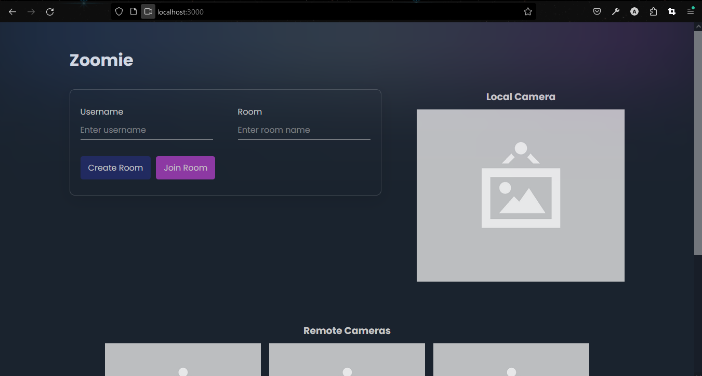

# Zoomie

This is a video chat app built with `simple WebRTC` and runs on express server. It uses `handlebars` for HTML templating and `vanilla JavaScript` with `Jquery.`

### Project Structure

zoomie
├── public
│ ├── images
│ │ └── image.png
│ │ └── Zoomie.png
│ ├── index.html
│ └── js
│   └── app.js
├── .gitignore
├── package-lock.json
├── package.json
├── README.md
└── server.js

### Running it Locally

You can clone the repo and run
``` 
    npm i express handlebars jquery
    npm start
 ```


To test the remote connections, host it somewhere which supports HTTPS protocol. 